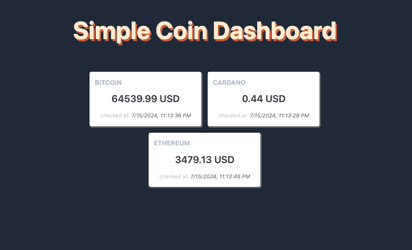

# Simple Coin Dashboard

A simple Typescript application using htmx that shows live cytpo prices for BTC,ETH and ADA.
The data is retrieved from CoinGecko



### How to run on development

Before running the application make sure you have added your CoinGecko API Key to the the `.env` file.
Fell free to use `.env.template` as inspiration.

```
npm install
npm run dev
```

### How to run via Docker

```
<!-- build the image -->
docker build -t simple-coin-dashboard .

<!-- run the containter -->
docker run -e COIN_GECKO_API_KEY='!your api key here!' \
  -d --name dashboard-app-server \
  -p 3000:3000 \
  simple-coin-dashboard:latest \

```
